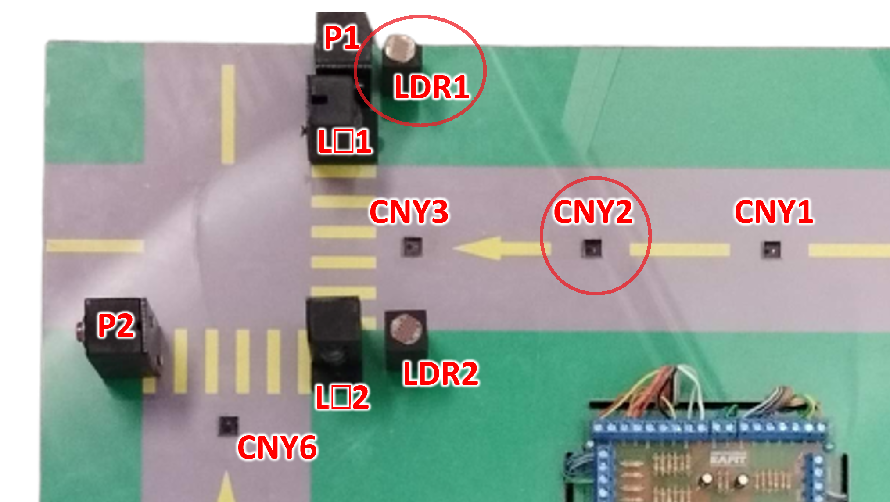

## Low Level

Este CPS gestiona un semáforo para automóviles y peatones, con un sensor infrarrojo para detectar vehículos. 
Controla el flujo del tráfico y la seguridad de los peatones ajustando los tiempos de luz verde y roja 
en función de la presencia de vehículos o solicitudes de paso de peatones.

 

**Figura 1**: Sensores low level.

## Entradas y Salidas
### Entradas:

Botón del peatón (P1): Indica la solicitud de cruce de peatones.
Sensor infrarrojo (CNY2): Detecta vehículos para ajustar el tiempo de luz verde.

### Salidas:

Luces de tráfico (LR1, LY1, LG1, LR2, LY2, LG2): Controlan el estado del semáforo para dos direcciones de tráfico.

